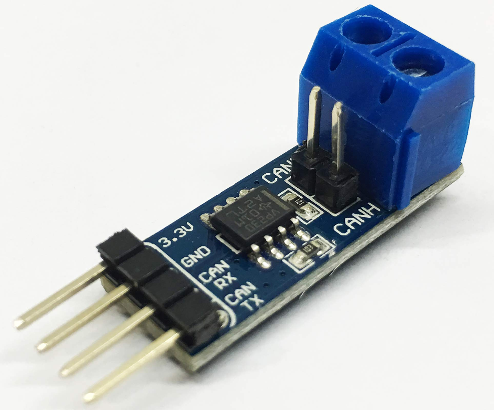

# ESP32-SN65HVD230-CAN

<p align="center">
  
  <br><sub>One example third-party breakout — boards vary, the datasheet does not</sub>
</p>

ESP-IDF component for polling-based Classic CAN over the ESP32 TWAI controller
and a TI SN65HVD230 transceiver.

- Plain C, five calls to send and receive
- Filtering, callbacks and bus-off recovery are opt-in, and cost nothing ignored
- One chipset on purpose — no ops tables, no descriptors, no indirection

> **Unverified on hardware.** Passes a host self-check against a stubbed TWAI
> driver; never built by ESP-IDF, never run on a device. Bench it first —
> starting with the filter, whose failure mode is silence, not an error.

## Install

| Need | Requirement |
|---|---|
| ESP-IDF, one channel | `>=5.0,<6.0` — builds on 5.0 and 5.1 via the legacy driver API |
| ESP-IDF, more than one | **`>=5.2`** — where the multi-controller API arrived |
| Target | `SOC_TWAI_SUPPORTED` — a target without one is refused at compile time |
| Transceiver | One per channel |

```bash
git clone https://github.com/JonasAtelier/esp-sn65hvd230-can.git components/hvd230_can
```

## Wiring

**The datasheet is the authority**, not any particular board. Pinout, logic
levels, mode behaviour and limits all come from
[`doc/sn65hvd230.pdf`](doc/sn65hvd230.pdf) — check it before you trust
anything below.

SN65HVD230 (SOIC-8), and where each pin goes:

| Pin | Name | Connect to |
|---|---|---|
| 1 | `D` | ESP32 TX GPIO — driver input |
| 2 | `GND` | Ground |
| 3 | `VCC` | 3.3 V |
| 4 | `R` | ESP32 RX GPIO — receiver output |
| 5 | `Vref` | Usually unused; VCC/2 reference out |
| 6 | `CANL` | Bus |
| 7 | `CANH` | Bus |
| 8 | `RS` | Mode select — see below |

`RS` is what `hvd230_standby()` and `hvd230_wake()` drive:

| RS | Mode |
|---|---|
| Low | High-speed, on the bus |
| High | Low-current standby |
| Resistor to GND | Slope control — not modelled here; drive it or tie it low |

Bus side:

- 100 nF bypass across VCC/GND
- Twisted pair for CANH/CANL, shared ground
- Exactly **two** 120 Ω terminators, one at each bus end

### If you use a breakout board

Third-party modules like the one pictured are common, and they vary. Check
your board against the datasheet — they routinely differ in:

- **Whether `RS` is brought out.** Many tie it off. If yours does, pass
  `CAN_NO_PIN` and `hvd230_standby()`/`hvd230_wake()` answer `CAN_ENOPIN`
- **Whether a 120 Ω terminator is fitted on-board.** Two on a bus, no more —
  a module that already has one counts
- **Silkscreen names.** `CAN TX`/`CAN RX` usually mean the chip's `D`/`R`, but
  some boards label them from the MCU's point of view and some do not

## Use

```c
#include "hvd230can.h"

hvd230_t can;
hvd230_init(&can);                                  /* required first */
hvd230_begin(&can, TX_PIN, RX_PIN, 500000);

uint8_t payload[8] = {1, 2, 3, 4, 5, 6, 7, 8};
hvd230_tx(&can, 0x200, payload, 8, false, 0);

can_frame_t frame;
if (hvd230_rcv(&can, &frame, 0) == CAN_OK) {
    /* frame.id, frame.data, frame.len, frame.extended */
}

hvd230_end(&can);                                   /* nothing does it for you */
```

Timeout `0` never blocks:

| Call | Answers | Meaning |
|---|---|---|
| `hvd230_rcv` | `CAN_ETIMEOUT` | Queue empty. Normal, not an error |
| `hvd230_tx` | `CAN_EQFULL` | Queue full, the bus is behind |

### API — the basics

| Call | Does |
|---|---|
| `hvd230_init(can)` | Prepare the handle. **Always first** |
| `hvd230_begin(can, tx, rx, bitrate)` | Go on the bus |
| `hvd230_tx(can, id, data, len, extended, timeout_ms)` | Queue a frame |
| `hvd230_rcv(can, frame, timeout_ms)` | Read one frame |
| `hvd230_end(can)` | Release the controller. **Always last** |

```c
typedef struct {
    uint32_t id;
    uint8_t  data[CAN_MAX_DLC];
    uint8_t  len;                /* 0..CAN_MAX_DLC */
    bool     extended;
} can_frame_t;
```

- Bitrates: `CAN_BITRATE_25K` … `CAN_BITRATE_1M`, anything else `CAN_EINVAL`
- One handle owns the controller at a time
- **No destructor** — miss `hvd230_end()` on any exit path and the controller
  stays claimed for the rest of the program

### API — beyond the basics

| Call | Does | Reach for it when |
|---|---|---|
| `hvd230_begin_ex(can, tx, rx, bitrate, rs, txq, rxq)` | Start, full form | You need deeper queues or the RS pin |
| `hvd230_set_controller(can, id)` | Pick the TWAI controller, **before begin** | The chip has more than one |
| `hvd230_tx_frame(can, frame, timeout_ms)` | Queue a `can_frame_t` | You already have one |
| `hvd230_set_filter(can, id, mask, extended)` | Hardware filter, **before begin** | Other devices share the bus |
| `hvd230_clear_filter(can)` | Remove it | |
| `hvd230_on_frame(can, id, mask, cb, ctx)` | Register a handler | Switching on the id gets unwieldy |
| `hvd230_dispatch(can, timeout_ms)` | Drain the queue into handlers | Instead of `hvd230_rcv()`, never both |
| `hvd230_clear_callbacks(can)` | Empty the table | |
| `hvd230_health(can, out)` | State and error counters | Anything is going wrong |
| `hvd230_set_auto_recover(can, restart_ms)` | Bus-off retry delay | The node must survive a cable fault |
| `hvd230_service(can)` | Advance recovery one step | Paired with the line above |
| `hvd230_flush_tx(can)` | Drop stale queued transmits | A late frame is worse than none |
| `hvd230_standby(can)` / `hvd230_wake(can)` | Transceiver power | You wired the RS pin |

| Constants | Where |
|---|---|
| What you pass — bitrates, `CAN_NO_PIN`, `CAN_MAX_DLC` … | `hvd230can.h` |
| Identifier ceilings, queue defaults, register layouts | `src/internal.h` |

### Return codes

| Code | Meaning |
|---|---|
| `CAN_OK` | Succeeded. For `send()`, queued — not delivered or ACKed |
| `CAN_ETIMEOUT` | Timed out; on `receive()` this means the queue is empty |
| `CAN_EINVAL` | Bad pin, bitrate, id, or len |
| `CAN_ENOTSTARTED` | Before `begin()` or after `end()` |
| `CAN_ESTANDBY` | Send attempted while in standby |
| `CAN_ENOPIN` | `standby()`/`wake()` without an RS GPIO |
| `CAN_EQFULL` | Non-blocking send, transmit queue full |
| `CAN_EDRIVER` | Driver failure, or an RTR frame dropped on purpose |
| `CAN_ENOSLOT` | Callback table full |

## Filtering and callbacks

Both match bitwise: `(frame.id & mask) == id`, so `0x200`/`0x7F0` covers
`0x200`–`0x20F`.

| | `hvd230_set_filter()` | `hvd230_on_frame()` |
|---|---|---|
| Rejects | In hardware, before the interrupt | In software, after |
| How many | One | `CAN_MAX_CALLBACKS` |
| When to set | **Before `begin`** — read once at install | Any time |

- Reading the mask as a range is the usual mistake
- `(id & mask)` must equal `id`, or nothing matches at all

```c
hvd230_set_filter(&can, 0x200, 0x7F0, false);   /* before begin */
hvd230_begin(&can, TX_PIN, RX_PIN, 500000);

hvd230_on_frame(&can, 0x200, 0x7F0, on_match, &state);
hvd230_on_frame(&can, 0, 0, on_everything, NULL);   /* mask 0 = catch-all */

while (true) {
    hvd230_service(&can);
    hvd230_dispatch(&can, 0);
    vTaskDelay(pdMS_TO_TICKS(10));
}
```

- Every matching handler fires — a catch-all and a specific one coexist
- Handlers run on your thread inside dispatch, and may do anything, send included
- Use dispatch **or** `hvd230_rcv()`, never both — one queue, first call wins

## Bus-off recovery

After 256 transmit errors the controller leaves the bus and never returns by
itself. One disconnected CAN_H does it, and every send reports `CAN_EDRIVER`
forever after.

```c
hvd230_set_auto_recover(&can, 500);   /* stores the delay; starts nothing */
hvd230_service(&can);                 /* in your loop; this is what recovers */
```

- **Both calls are required** — one stores the delay, the other recovers
- Default `CAN_NO_AUTO_RECOVER` never recovers, matching Linux `restart-ms`:
  a bus that keeps failing is a wiring fault worth seeing

`hvd230_health()` fills a `can_health_t`:

| Counter | Says |
|---|---|
| `tx_err_cnt` climbing | Bus-off is coming — check termination, wiring, bitrate |
| `rx_miss_cnt` > 0 | Your `rx_queue` is too small, or your loop too slow |
| `arb_lost_cnt` climbing | Bus is saturated, low-priority frames starving |

`h.state` is one of:

| State | Meaning |
|---|---|
| `CAN_STATE_STOPPED` | Installed but not running |
| `CAN_STATE_RUNNING` | On the bus |
| `CAN_STATE_BUS_OFF` | Too many transmit errors; off the bus entirely |
| `CAN_STATE_RECOVERING` | Waiting out the sequence `hvd230_service()` started |

## Gotchas

**Bound your drain loop.** While bus-off, receive returns `CAN_EDRIVER` every
call, never `CAN_ETIMEOUT`, so an unbounded loop spins forever.

```c
for (int i = 0; i < RX_QUEUE; i++) {
    const can_sta res = hvd230_rcv(&can, &frame, 0);
    if (res == CAN_ETIMEOUT) break;     /* empty */
    if (res != CAN_OK) continue;        /* dropped, keep draining */
    handle(&frame);
}
```

**Nothing runs in the background.**

- Callbacks fire in `hvd230_dispatch()`, recovery in `hvd230_service()`
- Both on your thread — your loop rate decides whether the queue overruns

**Thread safety.**

- Every call is safe from any task
- The lock is not held across blocking driver calls, nor while callbacks run
- It does not protect whatever you share through `ctx`

## Limitations

- Classic CAN only, by construction. No CAN FD. RTR frames are dropped.
- One controller per process, one hardware filter, single-filter mode only.
- The eight standard bitrates; no custom timing, listen-only, or no-ACK mode.
- TWAI alerts not exposed — state is polled via `health()`.
- A node in bus-off cannot end cleanly. Recover first.

## Examples

| Example | Shows |
|---|---|
| [`basic_transmit.c`](examples/basic_transmit.c) | Queueing a frame |
| [`basic_receive.c`](examples/basic_receive.c) | Polling for frames |
| [`callbacks.c`](examples/callbacks.c) | Routing by identifier |
| [`protection.c`](examples/protection.c) | Queue sizing, recovery, counters |
| [`callbacks_health.c`](examples/callbacks_health.c) | Both together — copy this for a real bus |
| [`throughput_tx.c`](examples/throughput_tx.c) + [`throughput_rx.c`](examples/throughput_rx.c) | Bus stress test, **two boards** |
| [`dual_channel.c`](examples/dual_channel.c) | Two CAN buses on one chip |

`app_main()` bodies, not buildable projects. Drop one into `main/`, set the
GPIOs and bitrate, `idf.py build`.

The throughput pair needs **two boards on one bus**, one running each half:

- Not a convenience — a CAN transmitter needs another node to ACK. Flood an
  empty bus and the sender hits bus-off and measures nothing
- Both run 30 s, then print what the channel carried
- TX measures the real on-wire frame length; RX reports goodput and losses

## More than one channel

Some parts have several TWAI controllers, each an independent bus — own pins,
bitrate, filter, queues and error state. They share nothing but the CPU.

| Target | Controllers |
|---|---|
| ESP32 | 1 |
| ESP32-S2 | 1 |
| ESP32-S3 | 1 |
| ESP32-C3 | 1 |
| ESP32-H2 | 1 |
| **ESP32-C6** | **2** |
| **ESP32-P4** | **3** |
| ESP32-C5 | No TWAI in ESP-IDF 5.4 yet |

Read from `soc_caps.h` in ESP-IDF 5.4, not from memory. Check your own target
rather than trusting the table:

```bash
grep SOC_TWAI_CONTROLLER_NUM \
  $IDF_PATH/components/soc/$IDF_TARGET/include/soc/soc_caps.h
```

One `hvd230_t` per channel, and pick the controller before `begin`:

```c
hvd230_t bus_a, bus_b;

hvd230_init(&bus_a);
hvd230_set_controller(&bus_a, 0);
hvd230_begin(&bus_a, 5, 4, CAN_BITRATE_1M);

hvd230_init(&bus_b);
hvd230_set_controller(&bus_b, 1);
hvd230_begin(&bus_b, 7, 6, CAN_BITRATE_500K);   /* nothing has to match */
```

- Controller `0` is the default, so single-channel code never mentions it
- On ESP-IDF 5.0 or 5.1 the driver uses the older single-controller API, and
  any id but `0` is `CAN_EINVAL` whatever the silicon has
- Two handles on the same controller is `CAN_EDRIVER`; two on different ones
  both work
- Each channel keeps its own error counters — a fault on one leaves the other
  alone, which is usually why you wanted two
- Each channel needs **its own transceiver**, its own pair, and its own two
  terminators. Two controllers is two buses, not one bus with two ports

See [`dual_channel.c`](examples/dual_channel.c).

## Sizing a bus

The test's two numbers answer "how many devices fit?":

```
capacity    = bitrate / bits_per_frame        frames a second
max devices = capacity x 0.7 / device_rate    frames a second, per device
```

**Size to 70 %, not 100 %:**

- A saturated bus starves its lowest-priority message
- No slack left to absorb the ~20 bits an error frame costs

At 1 Mbit/s, 8-byte frames, 123 bits measured — so ~8130 frames/s:

| Device cycle | Frames/s each | Devices at 70 % |
|---|---|---|
| 1 ms | 1000 | 5 |
| 10 ms | 100 | 56 |
| 100 ms | 10 | 569 |

Re-run at your own bitrate and payload rather than scaling by eye — bits per
frame is payload dependent, which is the point of measuring it.

What usually caps you before bandwidth does:

| Limit | Roughly |
|---|---|
| Bus length | ~40 m at 1 Mbit/s, scaling inversely with bitrate |
| Stub reflections | Grow with node count; show as `bus_err` under load |
| Transceiver node limit | Electrical, not bandwidth — see [`doc/sn65hvd230.pdf`](doc/sn65hvd230.pdf) |

## Layout

| File | Holds |
|---|---|
| `src/core.c` | lifecycle, RS pin, filter — latched at install, so it starts here |
| `src/io.c` | send, receive, flush, and the callback table that routes frames |
| `src/health.c` | error counters and the bus-off recovery walk |
| `src/internal.h` | the lock, the validation helpers, the TWAI conversions |

## License

MIT — see [LICENSE](LICENSE).
